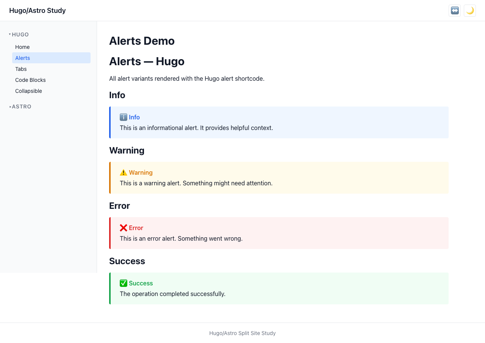
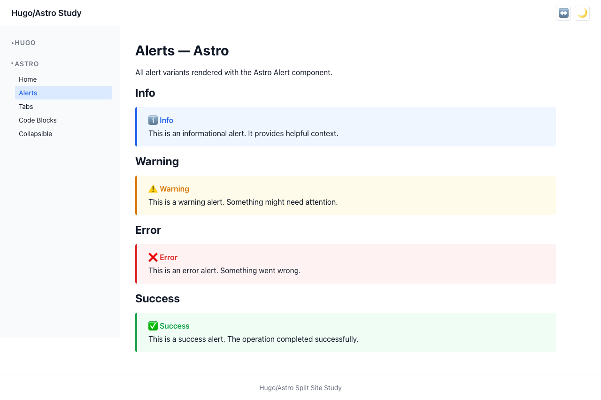
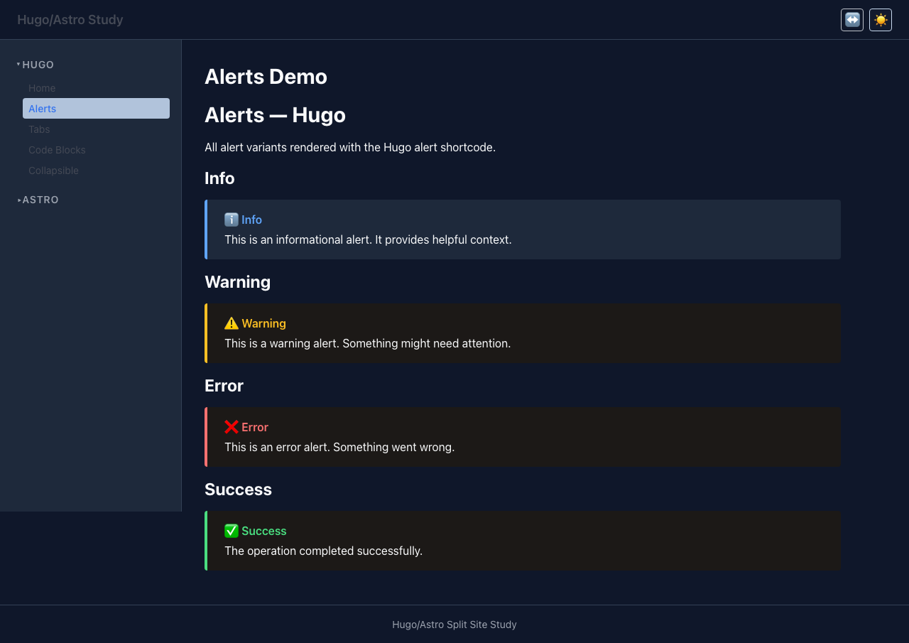

# User Story: Alerts

> **As a user, I can see contextual alert messages that convey different levels of severity.**

## Description

Alert components display informational, warning, error, or success messages with appropriate visual styling and ARIA semantics.

## How it works

- **Astro**: Uses a static `Alert.astro` component with a `type` prop (info, warning, error, success).
- **Hugo**: Uses an `alert.html` shortcode with a `type` parameter.
- Both use shared CSS (`alert.css`) with BEM classes and color tokens from the design system.
- Emoji prefixes provide additional visual cues without requiring icon assets.

## Accessibility

- `role="alert"` for urgent alerts (error, warning) — announces to screen readers immediately
- `role="status"` for informational alerts (info, success) — announces politely
- Semantic color tokens ensure sufficient contrast in both light and dark modes

## Screenshots

### Hugo alerts

### Astro alerts

### Dark mode alerts

