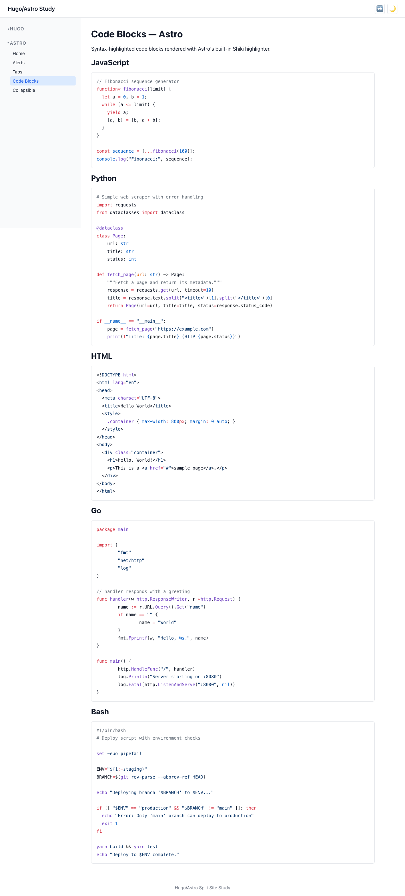
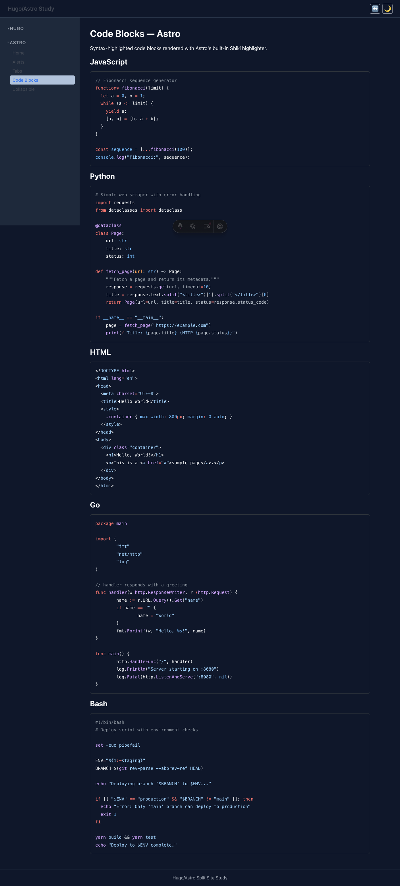

# User Story: Code Blocks

> **As a user, I can view syntax-highlighted code in multiple programming languages.**

## Description

Code blocks render with syntax highlighting, supporting JavaScript, Python, HTML, Go, and Bash. The highlighting uses shared color tokens so the visual style is consistent across both platforms.

## How it works

- **Hugo**: Uses Chroma (Hugo's built-in highlighter) configured with `noClasses = false` to output CSS classes. The `code-chroma.css` file maps Chroma's class names to shared color tokens.
- **Astro**: Uses Shiki (Astro's built-in highlighter) with the `css-variables` theme. The `code-shiki.css` file maps Shiki's CSS variable names to shared color tokens.
- Shared `code.css` provides the container styling (border, border-radius, padding, font) used by both platforms.

## Caveats

- Individual token colors may differ slightly between Chroma and Shiki since the highlighters use different grammar definitions and token classification. The overall color palette (keywords, strings, comments, etc.) is visually consistent.
- The `css-variables` theme in Shiki uses inline styles with CSS variable references, while Chroma uses CSS classes. Both map back to the same design tokens.

## Screenshots

### Light mode

### Dark mode

