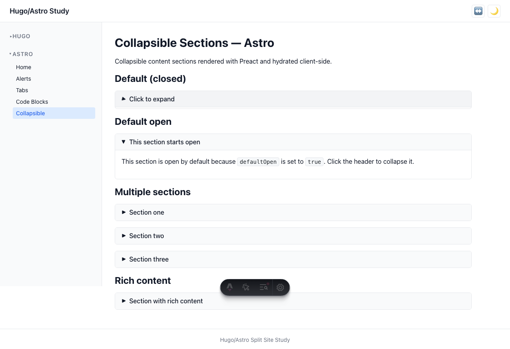

# User Story: Collapsible Sections

> **As a user, I can expand and collapse content sections to manage information density.**

## Description

Collapsible sections allow content to be hidden behind a clickable header. Sections can be configured to start open or closed, and support smooth CSS animations.

## How it works

- **Astro**: Uses a Preact component (`Collapsible.tsx`) hydrated with `client:load`. State toggles the `collapsible--open` class.
- **Hugo**: Uses a `collapsible.html` shortcode with inline vanilla JS for toggle behavior.
- The slide animation uses the `grid-template-rows` CSS technique (transitioning between `0fr` and `1fr`) for smooth content reveal without fixed heights.
- Both implementations share the same CSS (`collapsible.css`) and ARIA attributes.

## Accessibility

- The toggle header is a `<button>` element, keyboard-operable with Enter/Space
- `aria-expanded="true|false"` on the button reflects the current state
- `aria-controls` links the button to the content panel's `id`
- `role="region"` on the content panel with `aria-labelledby` referencing the button
- The chevron icon (▶) rotates 90° when open, providing a visual indicator

## Screenshots

### Sections closed (default state)

### Section opened after click

