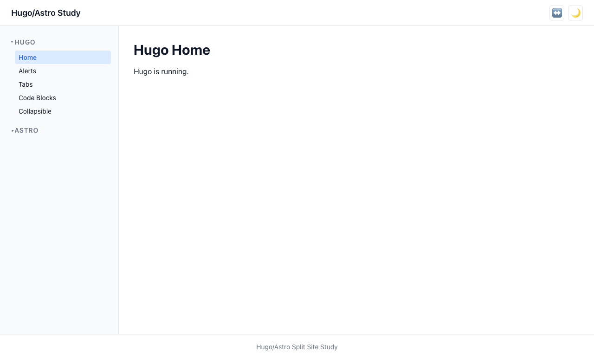
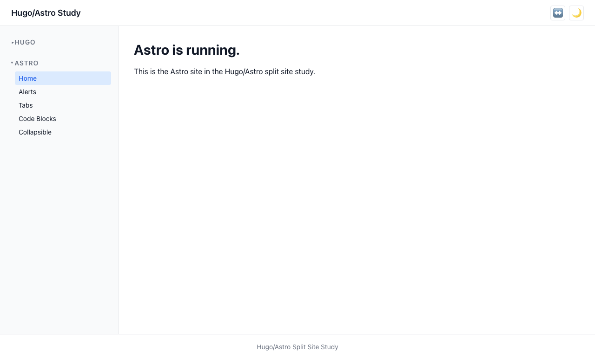
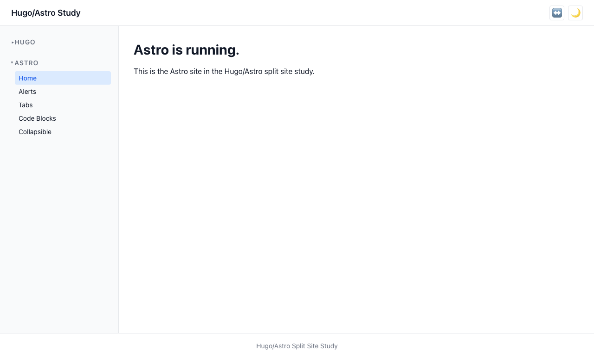

# User Story: Seamless Navigation

> **As a user, I can seamlessly navigate between Hugo and Astro pages without noticing the framework boundary.**

## Description

The site uses a Caddy reverse proxy to combine Hugo (at `/hugo/`) and Astro (at `/astro/`) behind a single origin (`localhost:3000`). View transitions create a smooth visual experience, with the shell (header, sidebar nav, footer) persisting across page loads.

## How it works

- The sidebar nav is driven by a shared `nav.yaml` file, rendered identically in both Hugo templates and Astro layouts.
- Astro uses `<ClientRouter />` for SPA-like transitions between Astro pages, with `data-astro-reload` on links to Hugo pages to force full navigation.
- Hugo uses the native View Transitions API (`<meta name="view-transition" content="same-origin">`) with matching `view-transition-name` values so shell elements visually persist.
- Both frameworks share the same CSS tokens and BEM classes, making the layouts visually identical.

## Screenshots

### Hugo page — before cross-platform navigation

### Astro page — after navigating from Hugo

### Astro page — before cross-platform navigation

### Hugo page — after navigating from Astro

## Caveats

- View transitions between Hugo and Astro are MPA transitions (full page loads). The visual smoothness depends on browser support for the View Transitions API (Chrome 111+).
- Settings (dark mode, density) persist across the boundary via `localStorage`, not via the URL or cookies.
