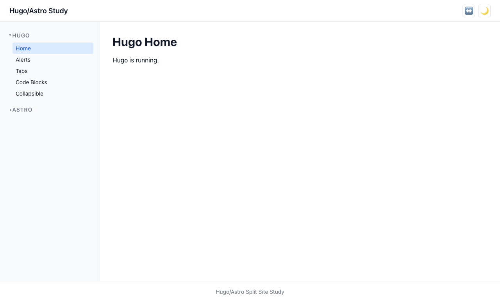
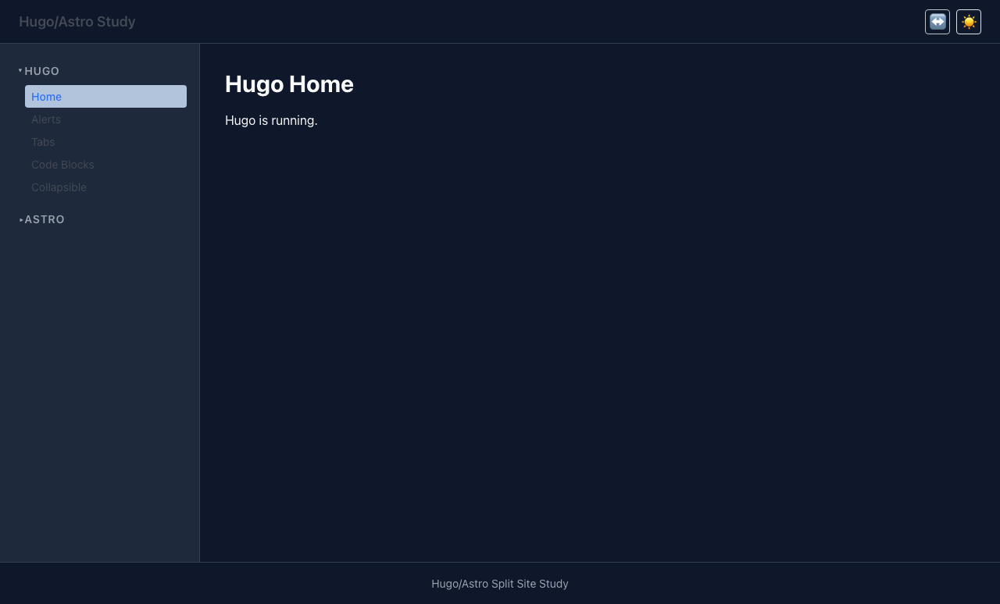
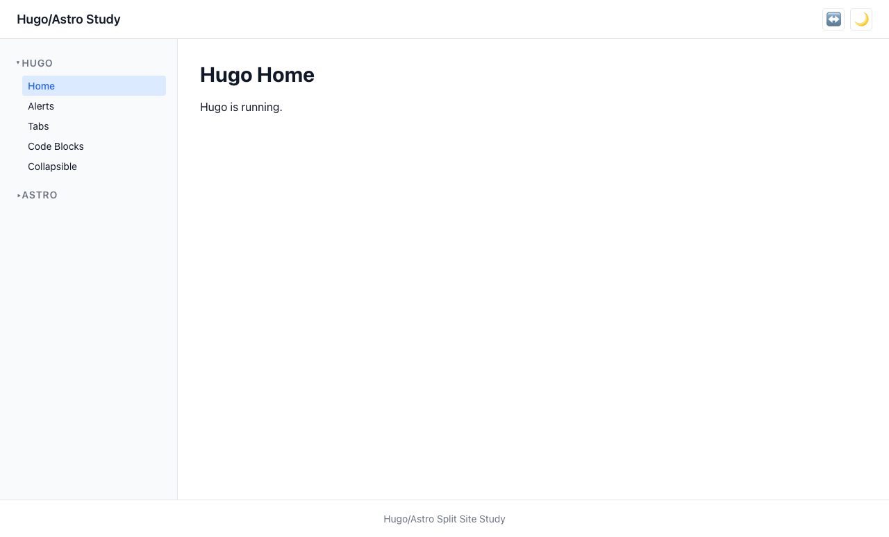
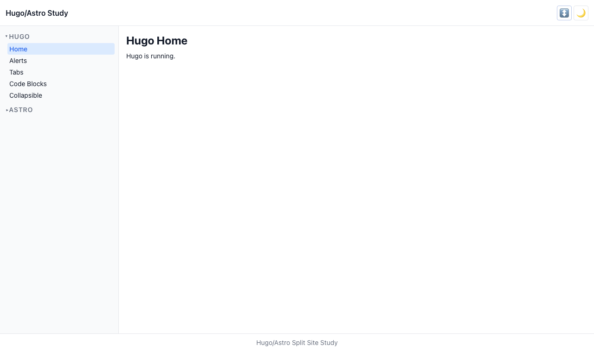

# User Story: Settings Toggles

> **As a user, I can toggle dark mode and whitespace density, and my preferences persist across pages and platforms.**

## Description

The header contains two settings toggle buttons: one for dark/light theme and one for standard/compact whitespace density. Preferences are saved to `localStorage` and restored on page load, even when navigating between Hugo and Astro pages.

## How it works

- A shared `settings-toggle.js` script (loaded inline in both Hugo and Astro layouts) handles:
  1. **Early restoration**: Before paint, the script reads `localStorage` and sets `data-theme` and `data-density` attributes on `<html>` to prevent flash of unstyled content.
  2. **Toggle handlers**: On `DOMContentLoaded`, click handlers are attached to the theme and density toggle buttons.
  3. **Cross-platform persistence**: Since Hugo and Astro are served from the same origin (`:3000` via Caddy), `localStorage` is shared between them.

- The theme system uses CSS custom properties that respond to `data-theme="dark"` and `data-density="compact"` selectors in `tokens.css`.

## Accessibility

- Toggle buttons have `aria-label` attributes describing the action (e.g., "Switch to dark mode")
- Both buttons are keyboard-accessible (Tab, Enter/Space)
- Emoji icons (🌙/☀️ for theme, ↔️ for density) provide visual cues

## Screenshots

### Light mode (default)

### Dark mode

### Standard density

### Compact density

