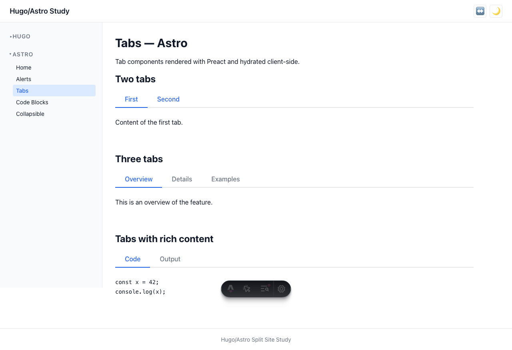
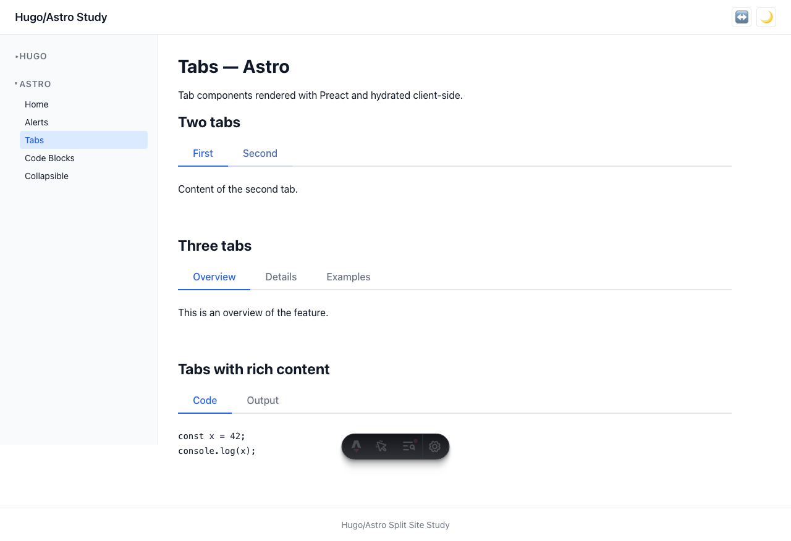

# User Story: Tabs

> **As a user, I can switch tabs with the tab nav to view different content panels.**

## Description

Tabs are an interactive component that allows users to switch between content panels. The component follows the WAI-ARIA Tabs pattern for full accessibility support.

## How it works

- **Astro**: Uses a Preact component (`Tabs.tsx`) hydrated with `client:load`. State management and keyboard handlers are implemented in Preact.
- **Hugo**: Uses shortcodes (`tabs.html` + `tab.html`) with vanilla JS for interactivity. The JS transforms the shortcode output into a proper ARIA tablist structure.
- Both implementations share the same CSS (`tabs.css`) and produce identical HTML structure with matching `data-testid` attributes.

## Accessibility

- `role="tablist"` on the tab navigation container
- `role="tab"` on each tab button, with `aria-selected="true"` on the active tab
- `role="tabpanel"` on each content panel, with `aria-labelledby` linking to the tab
- Arrow key navigation: Left/Right arrows move focus between tabs, Home/End jump to first/last
- Focus management with `tabindex` so only the active tab is in the tab order

## Screenshots

### First tab active

### Second tab active (after click)

